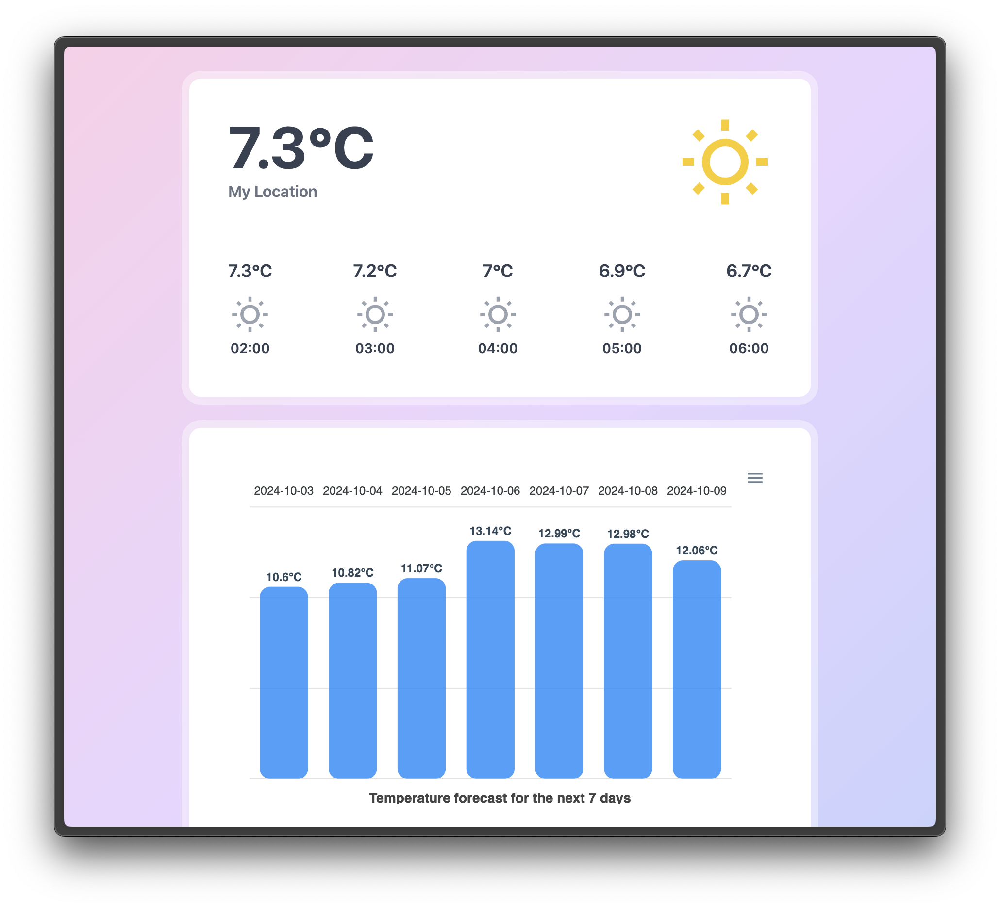

## Realpad Realtime weather api

This is an api that returns the current weather for a given location. The backend is built with Java and Spring Boot, and the frontend is built with Vue.js.

  
  
Screenshot of the frontend

## How to run the project

- Using docker compose:
  - Clone the repository
  - build the `war` file by running `./mvnw clean package` or `make package` if you have `make` installed.
  - Run `docker-compose up` in the root directory
  - The frontend will be available at `http://localhost:5173`
  - The backend will be available at `http://localhost:8080`